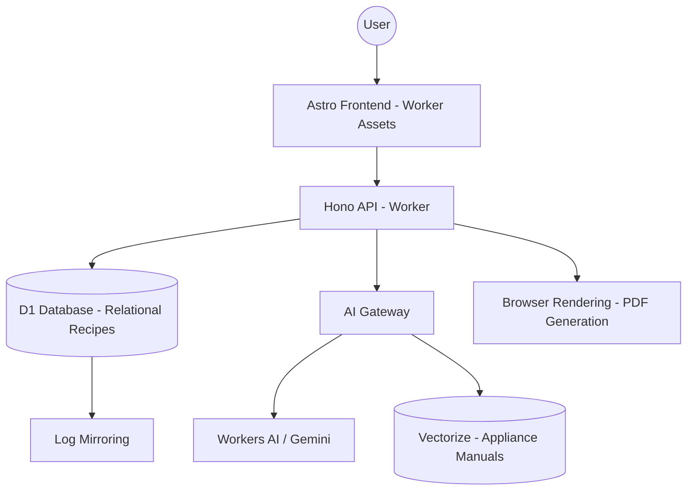

# ChefOS — Smart Recipe Engine Product Requirements Document

## 1. Executive Summary

ChefOS is a high-performance Cloudflare Worker application that retrofits the legacy `gas-recipe-to-doc` script into a unified full-stack platform. Instead of exporting to Google Docs, ChefOS serves an interactive frontend where recipes are dynamically modified by AI. The "killer feature" is **Hardware-Aware Cooking**: the system performs RAG (Retrieval-Augmented Generation) against your specific appliance user manuals (stored in Vectorize) to rewrite recipe steps so they match the exact buttons, settings, and terminology of the air fryer, multicooker, or oven you actually own.

## 2. Target Users & Use Cases

- **The Home Chef**: Needs ingredient alternatives on the fly and exact instructions for their specific appliances.
- **The Organizer**: Wants a centralized, searchable database of recipes that can be printed into professional-grade "physical cookbooks."

## 3. System Architecture Overview



## 4. Cloudflare Services Used

| Service               | Purpose                                               | Binding Name    |
| :-------------------- | :---------------------------------------------------- | :-------------- |
| **D1 Database**       | Relational storage for recipes, appliances, and logs. | `DB`            |
| **Vectorize**         | Vector search for appliance manual chunks.            | `VECTOR_INDEX`  |
| **Workers AI**        | Embedding generation and text inference.              | `AI`            |
| **Browser Rendering** | Printing recipes to 8.5x11 PDF.                       | `MY_BROWSER`    |
| **Durable Objects**   | Powering the Kitchen Orchestrator Agent.              | `KITCHEN_AGENT` |
| **Worker Assets**     | Hosting the Astro frontend.                           | `ASSETS`        |

## 5. Wrangler Configuration Blueprint

```jsonc
{
  "$schema": "node_modules/wrangler/config-schema.json",
  "name": "chef-os",
  "main": "src/backend/index.ts",
  "compatibility_date": "2026-04-09",
  "compatibility_flags": ["nodejs_compat"],
  "assets": {
    "directory": "./dist",
    "binding": "ASSETS",
    "not_found_handling": "single-page-application",
  },
  "d1_databases": [
    {
      "binding": "DB",
      "database_name": "chef-db",
      "database_id": "auto",
      "migrations_dir": "./drizzle",
    },
  ],
  "vectorize": [
    {
      "binding": "VECTOR_INDEX",
      "index_name": "appliance-manuals",
    },
  ],
  "browser": {
    "binding": "MY_BROWSER",
  },
  "durable_objects": {
    "bindings": [{ "name": "KitchenAgent", "class_name": "KitchenOrchestrator" }],
  },
  "migrations": [{ "tag": "v1", "new_sqlite_classes": ["KitchenAgent"] }],
  "vars": {
    "AI_GATEWAY_NAME": "default-gateway",
  },
  "observability": {
    "enabled": true,
    "logs": { "invocation_logs": true, "head_sampling_rate": 1 },
  },
}
```

## 6. Database Design

### 6.1 Schema Overview

Relational normalization splitting recipes from their ingredients and steps, with a separate module for appliance hardware.

### 6.2 Table Specifications

- **`recipes`**: `id`, `title`, `description`, `category`, `tags`, `rating`, `is_favorite`, `created_at`.
- **`ingredients`**: `id`, `recipe_id`, `name`, `amount`, `unit`, `notes`.
- **`instructions`**: `id`, `recipe_id`, `step_number`, `text`, `appliance_type_needed`.
- **`appliances`**: `id`, `name`, `brand`, `model`, `manual_url`, `type` (e.g., 'Air Fryer').

### 6.3 Common Queries

- _Verification_: `SELECT * FROM recipes WHERE is_favorite = 1;`
- _RAG Context_: `SELECT * FROM appliances WHERE type = 'Air Fryer';`

## 7. API Design

- **`GET /api/recipes`**: List all recipes with metadata.
- **`POST /api/recipes/generate`**: Retrofitted GAS logic - takes a raw URL/text and returns a normalized recipe object.
- **`GET /api/recipes/:id/pdf`**: Triggers Browser Rendering to produce the 8.5x11 PDF.
- **`POST /api/kitchen/tailor`**: Input: `recipe_id` + `appliance_id`. Output: Customized instructions.

## 8. AI & Agents

### 8.1 Agent Inventory

- **`KitchenOrchestrator`**: `AIChatAgent` class. Handles "What can I use instead of buttermilk?" and "How do I cook this on my Ninja Foodi?"

### 8.2 Agent Prompts

**Kitchen Orchestrator System Prompt**:

> You are an expert Sous Chef and technical manual specialist. Your job is to help users modify recipes. When asked about appliances, you will receive context from the device's actual user manual. You must use the EXACT terminology from the manual (e.g., if the manual says 'Air Crisp', do not say 'Air Fry'). If asked for ingredient substitutes, provide 3 options: 1:1 swap, budget swap, and professional preference.

## 9. Frontend UX Design

- **Standard Pages**: Landing, Docs (API/Schema), Health Dashboard, Chat Interface.
- **Recipe Detail Page**: Toggles for "Ingredient Alternatives" and a dropdown to select your owned appliances to see instructions rewrite in real-time.
- **Print Template**: A dedicated route `/print/:id` that hides nav/footer and uses CSS `grid` to layout a beautiful front/back recipe card.
